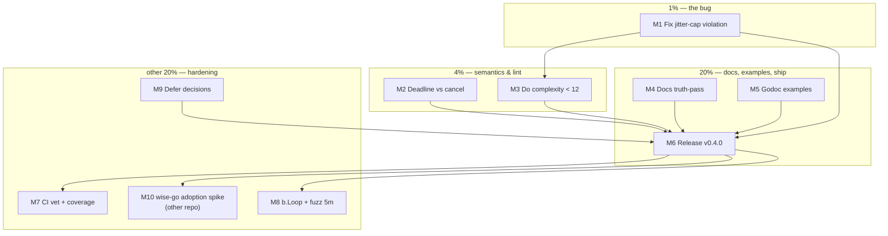

# go-retry — Cap-and-Semantics Hardening Plan

**Date:** 2026-08-21 23:48
**Trigger:** post-v0.3.1 improvement review ahead of a potential wise-go adoption
**Scope:** `github.com/larsartmann/go-retry` (single package, 4 Go files, 31 tests, 100% claimed coverage)
**Baseline:** master clean at `1d002da`, lint = 1 `cyclop` warning (`Do` complexity 13 > 12), vet green.

---

## 0. What this plan is built on — verified, not guessed

Every finding below was verified against the code or an executed probe before
planning. Two claims from the initial review were **wrong and are retracted** —
recorded here so the plan doesn't inherit them.

| #  | Finding                                                                                                                                                                                             | Verdict                    | Evidence                                                                                                                                                                                                                       |
| -- | --------------------------------------------------------------------------------------------------------------------------------------------------------------------------------------------------- | -------------------------- | ------------------------------------------------------------------------------------------------------------------------------------------------------------------------------------------------------------------------------ |
| F1 | **Jitter breaks the MaxDelay cap.** `computeDelay` caps at `maxDelay` _before_ adding up to 50% jitter, so real sleeps reach 1.5× MaxDelay while `Backoff`/`ComputeDelay` doc "capped at MaxDelay". | **CONFIRMED (bug)**        | 20 000-iteration probe: max observed **299.996 ms** against declared cap 200 ms (`retry.go:150-177`)                                                                                                                           |
| F2 | **Deadline-exceeded is mislabeled as "canceled".** The `select` on `ctx.Done()` fires for both cancel and deadline; both become `ErrCanceled` / "retry canceled during backoff".                    | Confirmed (code read)      | `retry.go:84-91` never consults `ctx.Err()`                                                                                                                                                                                    |
| F3 | ~~Nested retries amplify~~ — an outer default-config loop would retry an inner `ErrExhausted`.                                                                                                      | **RETRACTED**              | `Family.IsRetryable() == (f == Transient)`; probe: outer loop ran **1** attempt on inner exhaustion. Infrastructure is fail-closed.                                                                                            |
| F4 | ~~Exhaustion wrapper hides the typed final error~~                                                                                                                                                  | **NARROWED to a docs gap** | `.WithCause(err)` sets `Unwrap()`, so `errors.Is`/`errors.AsType` traverse to the cause. No shim needed for adoption — unlike failsafe-go, whose `ExceededError` carries the final result as a struct field outside the chain. |
| F5 | `Do` cyclomatic complexity 13 > lint max 12                                                                                                                                                         | Confirmed (live lint)      | the repo's only lint issue                                                                                                                                                                                                     |
| F6 | Recorded decision 2026-08-08: **defer** configurable jitter; accept additive strategy                                                                                                               | Binding constraint         | `docs/status/2026-08-08_11-12_jitter-deferral-decision.md`, ROADMAP, FEATURES                                                                                                                                                  |

Consequence for scope: **no change to the exhaustion return shape and no jitter-strategy
redesign** — F3/F4 killed those; the 2026-08-08 decision (F6) defers strategy work.
What remains is one real bug, one semantic mislabel, and the repo's own TODO backlog.

---

## 1. Pareto breakdown

### The 1% that delivers 51%

**Fix the MaxDelay cap violation (F1).** It is the only correctness bug in the
library: two exported functions (`Backoff`, `ComputeDelay`) promise a cap the
implementation breaks by up to 50%. Any consumer sizing timeouts/SLAs around
MaxDelay is silently wrong. ~15 minutes including tests.

### The 4% that deliver 64%

1. **Deadline-vs-cancel distinction (F2)** — `errors.Is(err, context.DeadlineExceeded)`
   must hold when a deadline, not a cancel, ended the loop. Operators debug
   timeouts vs shutdowns differently; today both look identical.
2. **Cyclomatic complexity fix (F5)** — the only lint warning in the repo; also
   the natural vehicle to make `Do` readable.

### The 20% that delivers 80%

3. **Docs truth-pass**: exhaustion semantics (F4 — the unwrap chain is the
   adoption story), nesting guidance (F3 — fail-closed, safe), README config
   table missing `DelayFunc` (repo TODO T3).
4. **Godoc examples**: `DelayFunc` (Retry-After pattern — the exact reason
   wise-go would adopt) and `FromPolicy` (TODO T4, T5).
5. **Release v0.4.0** — F1+F2 are behavior changes; 0.x minor is the correct
   vehicle, and the cap fix is worthless to consumers until tagged.

### The other 20% → 100%

6. CI: `go vet` step (T6) + coverage floor (T7).
7. Benchmark modernization `b.Loop()` (T2) + the 5-minute fuzz campaign on
   the existing target (T8).
8. Design notes only: `OnSuccess(attempts)` hook; equal-jitter revisit — both
   recorded as decisions to defer (F6 discipline), not code.
9. **wise-go adoption spike** — the payoff. Lives in the wise-go repo; tracked
   here only as the follow-up link.

---

## 2. Comprehensive plan — medium granularity (30–100 min each)

Sorted by importance → impact → effort → customer-value.

| ID  | Task                                                                                                                                                     | Why (customer value)                                                         | Impact           | Effort           | Tier      |
| --- | -------------------------------------------------------------------------------------------------------------------------------------------------------- | ---------------------------------------------------------------------------- | ---------------- | ---------------- | --------- |
| M1  | Fix jitter-cap violation: cap **after** jitter in `computeDelay`; regression test asserting `delay <= MaxDelay` over N samples                           | The one real bug; restores the documented contract both exported fns promise | Critical         | 30m              | 1%        |
| M2  | Distinguish deadline-exceeded from cancellation: branch on `ctx.Err()`, wrap deadline with `context.DeadlineExceeded` in the chain; tests for both paths | Correct timeout-vs-shutdown semantics for operators                          | High             | 30m              | 4%        |
| M3  | Extract delay-computation+hooks helper from `Do` → complexity < 12; keep behavior identical (suite green, `-count=10`)                                   | Kills the only lint warning; readability                                     | Medium           | 30m              | 4%        |
| M4  | Docs truth-pass: `Do`/`ErrExhausted` godoc (unwrap traversal, fail-closed nesting), README `DelayFunc` row + semantics section                           | Unblocks wise-go adoption reasoning; README stops lying by omission          | Medium           | 45m              | 20%       |
| M5  | Godoc examples: `ExampleDo_delayFunc` (Retry-After), `ExampleFromPolicy`, both with `// Output:`                                                         | pkg.go.dev shows the killer feature correctly                                | Medium           | 45m              | 20%       |
| M6  | Release v0.4.0: CHANGELOG section (behavior changes called out), TODO_LIST/FEATURES/ROADMAP refresh, tag + push + GitHub release                         | Value reaches consumers; proxy-indexed                                       | High             | 60m              | 20%       |
| M7  | CI hardening: `go vet` step + coverage floor job                                                                                                         | Keeps 100% coverage and vet honest in CI                                     | Medium           | 60m              | other 20% |
| M8  | Test polish: `b.Loop()` benchmark, 5m fuzz run with corpus preservation                                                                                  | Cheap insurance on the panic-hardened path                                   | Low              | 30m              | other 20% |
| M9  | Decision records: `OnSuccess` hook and equal-jitter strategy — write the defer/spec notes, no code                                                       | Prevents scope creep now; primes v1.0 decisions                              | Low              | 30m              | other 20% |
| M10 | Follow-up link: wise-go failsafe→go-retry adoption spike (executed in wise-go repo)                                                                      | The actual 80% payoff of this whole effort                                   | High (elsewhere) | — (out of scope) | other 20% |

Dependency: M1 → M3 (extract first would churn the same lines twice otherwise is
acceptable, but bug first keeps the fix diff minimal). M1+M2+M3 → M6 (release gates
on code being done). M4/M5 anytime before M6. M7/M8/M9 independent, post-release ok.

## 3. Detailed breakdown — fine granularity (≤ 12 min each)

| ID    | Task (one sitting each)                                                                                                                  | Parent | Est |
| ----- | ---------------------------------------------------------------------------------------------------------------------------------------- | ------ | --- |
| F1.1  | Write failing regression test: `ComputeDelay(100ms, 200ms, 2, n)` sampled 20 000×, assert `<= 200ms`                                     | M1     | 6m  |
| F1.2  | Reorder `computeDelay`: jitter first, then `min(delay+jitter, maxDelay)`; keep B1–B3 guards                                              | M1     | 8m  |
| F1.3  | Update `Backoff`/`ComputeDelay` doc comments (cap now strictly true); note behavior change                                               | M1     | 5m  |
| F1.4  | Full suite `go test ./... -race -count=10` green; lint clean for touched lines                                                           | M1     | 5m  |
| F2.1  | Write failing test: `WithTimeout` expiring during backoff → expect `errors.Is(err, context.DeadlineExceeded)`                            | M2     | 8m  |
| F2.2  | Branch on `ctx.Err()` in the select; deadline path wraps `context.DeadlineExceeded` (keep `ErrCanceled` for cancel only); update godoc   | M2     | 10m |
| F2.3  | Test cancel path still `ErrCanceled`; suite green                                                                                        | M2     | 4m  |
| F3.1  | Extract `nextDelay(config, attempt, err)` helper (delay + `DelayFunc` override + `OnRetry`)                                              | M3     | 8m  |
| F3.2  | Verify `Do` complexity < 12 (lint), suite `-count=10` green                                                                              | M3     | 4m  |
| F4.1  | Godoc on `Do`/`ErrExhausted`: unwrap chain reaches last attempt's error; nested-loop fail-closed note                                    | M4     | 8m  |
| F4.2  | README: add `DelayFunc` row to config table                                                                                              | M4     | 5m  |
| F4.3  | README: short "Exhaustion & nesting" section                                                                                             | M4     | 8m  |
| F5.1  | `ExampleDo_delayFunc` with `// Output:` (deterministic DelayFunc)                                                                        | M5     | 10m |
| F5.2  | `ExampleFromPolicy` with `// Output:`                                                                                                    | M5     | 8m  |
| F5.3  | `go test` examples render + run green                                                                                                    | M5     | 3m  |
| F6.1  | CHANGELOG `[0.4.0]`: Added/Fixed with both behavior changes called out                                                                   | M6     | 10m |
| F6.2  | Refresh TODO_LIST (harvest T1–T5 done), FEATURES, ROADMAP line refs                                                                      | M6     | 10m |
| F6.3  | Commit, tag `v0.4.0` (annotated, behavior-change summary), push master+tag                                                               | M6     | 8m  |
| F6.4  | GitHub release + verify proxy `@v/list` + clean-dir `go get@v0.4.0`                                                                      | M6     | 10m |
| F7.1  | Read `.github/workflows/ci.yml`, add `go vet` step                                                                                       | M7     | 6m  |
| F7.2  | Add coverage job with floor (e.g. 95%, not 100 — jitter headroom)                                                                        | M7     | 10m |
| F7.3  | Push, verify CI green on the release-adjacent commit                                                                                     | M7     | 6m  |
| F8.1  | `BenchmarkComputeDelay` → `b.Loop()`                                                                                                     | M8     | 4m  |
| F8.2  | `go test -fuzz=FuzzComputeDelayNeverPanics -fuzztime=5m`; commit interesting corpus                                                      | M8     | 10m |
| F9.1  | ROADMAP: defer-note for `OnSuccess(attempts)` with rationale                                                                             | M9     | 6m  |
| F9.2  | FEATURES WORTH_CONSIDERING: equal-jitter note updated (cap fix makes additive safe; strategy still deferred)                             | M9     | 6m  |
| F10.1 | wise-go repo: add adoption TODO (swap failsafe executor → go-retry `Do`, delete `classifyExhaustedRetries`, Retry-After via `DelayFunc`) | M10    | 8m  |

**Total:** 28 tasks ≈ 3.5–4 h of focused work (M1–M6 ≈ 2.5 h core, M7–M9 ≈ 1 h polish).

---

## 4. Execution graph

## 5. Guardrails (do not verschlimmbessern)

1. **No exhaustion-shape change** — F3/F4 retracted the motivation; the wrapper
   with `WithCause` is correct and adoption-friendly.
2. **No jitter-strategy redesign** — recorded 2026-08-08 decision stands; the
   cap fix makes the current additive strategy contract-safe.
3. **Behavior changes ship as v0.4.0** — a 0.x minor, called out in CHANGELOG
   with migration notes (deadline now unwraps to `context.DeadlineExceeded`).
4. Suite must stay green with `-race -count=10` after every M-task; coverage
   stays ≥ its current floor before the release tag.
5. `computeDelay`'s B1–B3 panic/overflow guards are load-bearing — the reorder
   must keep them, and the fuzz target must still pass.
