# Pareto Execution Plan — go-retry — CI Trust, Release, and the v1 Track

**Created:** 2026-09-13 17:50 CEST
**Mode:** planning only (execution starts on approval)
**Format note:** `.md` with a mermaid graph per explicit user instruction
(skill default is a styled HTML report — override honored, not propagated).
**Skill:** `pareto-planning`; task universe sourced from `TODO_LIST.md`
(T16–T21), the 2026-09-13 14:48 status report §f (50 items), `ROADMAP.md`,
and `FEATURES.md` WORTH_CONSIDERING.

---

## 0) Verified baseline (do not Verschlimmbessern this)

| Fact                                                                                                                                                                               | Evidence                                            |
| ---------------------------------------------------------------------------------------------------------------------------------------------------------------------------------- | --------------------------------------------------- |
| CI **green** on `cf3cd40e` and `b356f636` — all 3 jobs, incl. the `exhaustruct_v5` migration, golangci v2.13.2, `timeout-minutes`, concurrency group                               | `gh run list`, 2026-09-13 15:43/15:46 UTC           |
| The earlier red runs (`5058fec5`, `8615ef8d`, PR #1 branch) were caused by v4's `exclude` key under `exhaustruct_v5`; fixed by dropping the settings block; `config verify` passes | `golangci-lint config verify` locally + run history |
| Dependabot opened its first-ever PR (#1: bump the actions group, 3 updates); checks mixed (old failures inherited from the broken base)                                            | `gh pr view`                                        |
| Coverage 100%, `-race -count=10` green, fuzz campaign clean, lint 0 issues                                                                                                         | session gate, 2026-09-13                            |
| `fuzz.yml` has never run (scheduled first fire: 2026-09-14 03:17 UTC)                                                                                                              | `gh run list --workflow fuzz.yml`                   |
| `[Unreleased]` holds 9 Added + 3 Changed entries, incl. the user-visible exhaustion-message change                                                                                 | `CHANGELOG.md`                                      |

**Guardrails (breaking any of these = Verschlimmbessern):**

1. Never re-open decided items: jitter deferral (twice decided), `OnSuccess`
   hook, `flake.nix`, badges/CODEOWNERS, Go Report Card, `errors.AsType`,
   phantom `Attempt`, delay-sequence table — all carry decision records.
2. Single-ownership docs: facts live in exactly one living doc; released
   CHANGELOG sections are append-only (never edit `[0.5.0]` and older).
3. `golangci-lint config verify` is part of the gate for any `.golangci.yml`
   change — plain `run` is not sufficient (proven today).
4. Preserve the three deliberate `//nolint:` markers; preserve terminal-error
   single-sourced constants; keep `-race` on every test invocation.
5. Function-name-only citations in prose docs; no line-number citations.
6. No force push; no `git reset`; owner approval gates: release cut, PR #1
   disposition, and any policy flip recorded in AGENTS.md.

---

## 1) Pareto breakdown — what delivers the result?

Value here = **trust** (green verified CI, pinned guarantees) × **ship**
(a release carrying the user-visible fixes) × **durability** (docs that don't
rot) × **future** (v1.0 API decisions). "Result" = a trustworthy v0.6.0 on a
self-verifying CI with a clear path to v1.0.

| Tier              | Effort share                | Value    | Tasks (medium IDs) | Why this concentration                                                                                                                                                                                                                                                        |
| ----------------- | --------------------------- | -------- | ------------------ | ----------------------------------------------------------------------------------------------------------------------------------------------------------------------------------------------------------------------------------------------------------------------------- |
| **1%**            | ~2 micro-tasks + 1 decision | **~51%** | M1, M2, M4         | CI-trust is confirmed (fix already runner-verified green); disposing of PR #1 unblocks all supply-chain updates; cutting v0.6.0 ships 12 changelog entries incl. the user-visible exhaustion-message fix. Nothing else matters if master is red or the release never happens. |
| **4%**            | +6 micro-tasks              | **~64%** | + M5, M6, M7       | The corpus↔seeds sync test removes the last hand-discipline; fuzz-job polish makes the daily campaign trustworthy; doc hardening kills the next three drift sources before they rot.                                                                                          |
| **20%**           | +~20 micro-tasks            | **~80%** | + M8–M13           | AGENTS prune keeps context lean; an actionlint gate stops YAML breaking master again; the shuffle trial closes the order-dependency question; fuzz dispatch completes T16; process institutionalization makes today's catches permanent.                                      |
| **remaining 80%** | rest                        | **100%** | + M14–M24, M26     | The v1.0 API track (audit, signature decision, options design, compat matrix, two feature decisions), supply-chain posture, and lifecycle upkeep. Large, deliberate, post-release.                                                                                            |

---

## 2) Comprehensive plan — medium granularity (30–100 min each, 25 tasks)

Sorted by importance → impact → effort → customer-value. ✓ = already
satisfied by work done before this plan was written.

| ID  | Task (outcome)                                                                                                                                                                                                                                                              | Min  | Tier | Depends             | Value note                               |
| --- | --------------------------------------------------------------------------------------------------------------------------------------------------------------------------------------------------------------------------------------------------------------------------- | ---- | ---- | ------------------- | ---------------------------------------- |
| M1  | **Close CI-trust confirmation (T16 part 1)** — record green runs `cf3cd40e`/`b356f636` in TODO_LIST T16, annotate the 14:48 report's verify items                                                                                                                           | 30 ✓ | 1    | —                   | Master trust restored + documented       |
| M2  | **Dispose of Dependabot PR #1 (T17)** — diff the 3 action bumps, verify SHAs (`git ls-remote` + each tag's `action.yml`), write an evidence-backed review with a merge/close recommendation, execute on owner's call, update AGENTS gotcha + TODO T17                       | 60   | 1    | —                   | Supply-chain unlocked; policy settled    |
| M3  | **Release prep v0.6.0 (T21 part 1)** — decide minor-vs-patch (exhaustion-message wording is user-visible → minor), curate `[Unreleased]` (order, wording, move-all-together), draft GitHub-only release notes, prep ROADMAP release line + compare links, full pre-tag gate | 90   | 1    | M1                  | Ships 12 entries incl. user-visible fix  |
| M4  | **Cut the release (T21 part 2)** — signed annotated tag, push, GitHub Release with composed notes, verify pkg.go.dev (incl. `ExampleDoWithValue`), post-release doc edits                                                                                                   | 60   | 1    | M3 + owner approval | The ship                                 |
| M5  | **Corpus↔seeds sync test (T20)** — `TestFuzzCorpusMirrorsSeeds`: every `f.Add` seed must have its `testdata/fuzz/` mirror; fail with a named missing file                                                                                                                   | 45   | 2    | M1                  | Kills the last hand-discipline           |
| M6  | **Fuzz job polish (T19)** — artifact named `fuzz-crash-corpus-${{ github.sha }}`, `-fuzzminimizetime` decision + value, CHANGELOG entry                                                                                                                                     | 30   | 2    | M1                  | Multi-crash archaeology + timeout safety |
| M7  | **Doc hardening** — de-hardcode "v2.13.2" in CONTRIBUTING/FEATURES ("pinned in ci.yml"), external-citation policy for `classify.go:NN` refs, dprint pass over this session's markdown, stale-version sweep                                                                  | 45   | 2    | —                   | Kills the next drift sources             |
| M8  | **AGENTS gotcha prune** — merge the Dependabot + manual-bumps gotchas post-PR#1, trim to ≤18, keep every gotcha load-bearing                                                                                                                                                | 30   | 3    | M2                  | Context stays lean at the 20-cap         |
| M9  | **Workflow gate (T18)** — choose surface (CI job vs pre-push hook vs documented manual), implement `actionlint` or equivalent, validate on both workflows, document                                                                                                         | 45   | 3    | M1                  | YAML errors die locally, not on master   |
| M10 | **`-shuffle=on` trial** — run suite 20× shuffled, analyze, adopt-in-CI or reject with a decision record                                                                                                                                                                     | 30   | 3    | —                   | Cheap order-dependency detector          |
| M11 | **Fuzz dispatch + verify (T16 part 2)** — `workflow_dispatch` fuzz.yml, confirm corpus load (14 entries) in the log, confirm artifact step skips on green, close T16                                                                                                        | 30   | 3    | M1                  | The last runner-unverified surface       |
| M12 | **`.config/metadata.yaml` audit** — determine purpose, document in AGENTS or flag for owner removal                                                                                                                                                                         | 30   | 3    | —                   | No more unknown files                    |
| M13 | **Process institutionalization** — write the marker-coverage + hash-verification + config-verify checklist into AGENTS (session ritual)                                                                                                                                     | 30   | 3    | —                   | Today's catches become permanent         |
| M14 | **v1.0 public API audit** — `go doc` enumerate all exported symbols + Config fields, walk each for leaks/doc-quality/need, record verdicts as a ROADMAP checklist                                                                                                           | 60   | 4    | M4                  | The v1.0 promise starts here             |
| M15 | **`AttemptFunc` signature decision** — survey 3–5 retry libraries, weigh error-passing vs attempt-only, decision record in ROADMAP                                                                                                                                          | 45   | 4    | M4                  | Deliberate, not accidental API           |
| M16 | **Options-pattern migration design** — goals, `With*` inventory, struct-literal compat story, recorded in ROADMAP                                                                                                                                                           | 60   | 4    | M4                  | Unblocks jitter config + future fields   |
| M17 | **Version-compat matrix** — extract the `go-error-family` API surface used, draft the go-retry × go-error-family matrix in ROADMAP                                                                                                                                          | 30   | 4    | —                   | Dependency-bump safety                   |
| M18 | **Deterministic RNG decision** — pluggable source vs test seam vs never; decision record (options migration is the likely vehicle)                                                                                                                                          | 30   | 4    | M16                 | FEATURES WORTH_CONSIDERING resolved      |
| M19 | **Deadline-aware budgeting decision** — semantics analysis + decision record                                                                                                                                                                                                | 30   | 4    | M16                 | FEATURES WORTH_CONSIDERING resolved      |
| M20 | **govulncheck supply-chain posture** — read the action's install mechanism, decide accept-`@latest` vs self-pinned step, implement if pinning                                                                                                                               | 45   | 4    | —                   | Conscious trust decision                 |
| M21 | **`-race` fuzz scoping** — measure race-fuzz throughput locally, decide cadence/job, scope the YAML                                                                                                                                                                         | 30   | 4    | —                   | Concurrency-bug coverage for the loop    |
| M22 | **Auto-PR crash-corpus loop design** — trigger, permissions, commit path; decision record in ROADMAP                                                                                                                                                                        | 30   | 4    | M11                 | Closes discovery→corpus automatically    |
| M23 | **Docs-site preconditions checklist** — tie the Astro/Starlight gate to the v1.0 freeze explicitly                                                                                                                                                                          | 30   | 4    | M14                 | Future option, priced now                |
| M24 | **CHANGELOG doc-convention decision** — whether doc-only changes get entries; record                                                                                                                                                                                        | 30   | 4    | —                   | Ends a recurring micro-debate            |
| M26 | **Report/plan lifecycle** — annotate the 14:48 report with M1–M13 verdicts, archive it + this plan when done, HARVEST leftovers into TODO_LIST                                                                                                                              | 30   | 3    | M11                 | No tombstone backlogs                    |

wise-go items (adoption spike, v1.0.0 tag, sandbox tests, CI re-enable) are
**out of this repo's scope** — they stay listed in the 14:48 report §f for the
wise-go sessions.

---

## 3) Fine breakdown — micro-tasks (≤12 min each, 78 tasks)

Sorted within tiers by importance → impact → effort. All times are ceilings.

| ID   | Micro-task                                                                                                                                    | Min | Parent |
| ---- | --------------------------------------------------------------------------------------------------------------------------------------------- | --- | ------ |
| 1.1  | Record green runs `cf3cd40e`/`b356f636` in TODO_LIST T16; mark its ci.yml half done                                                           | 8   | M1     |
| 1.2  | Annotate 14:48 report §f.1–5 verify items with the run IDs                                                                                    | 10  | M1     |
| 2.1  | Fetch PR #1 diff; list the 3 action bumps (old SHA → new SHA each)                                                                            | 8   | M2     |
| 2.2  | Verify each new SHA: `git ls-remote` + read the tag's `action.yml`                                                                            | 12  | M2     |
| 2.3  | Check each bump against usage (inputs still supported: `repo-checkout`, `go-version-file`, `version`, `cache`)                                | 12  | M2     |
| 2.4  | Write the PR review: evidence table + merge/close recommendation                                                                              | 10  | M2     |
| 2.5  | Owner checkpoint: merge or close (g.2 answer)                                                                                                 | 2   | M2     |
| 2.6  | Execute the decision; confirm checks go/stay green post-merge                                                                                 | 8   | M2     |
| 3.1  | Load the `go-release` skill; re-read the release phases                                                                                       | 8   | M3     |
| 3.2  | Decide v0.5.1 vs v0.6.0 from the error-family convention; write the rationale into the release notes draft                                    | 10  | M3     |
| 3.3  | Curate `[Unreleased]`: section order Added→Changed, wording pass, confirm the two pre-session pins ride along                                 | 12  | M3     |
| 3.4  | Draft the GitHub-only release notes (user-facing summary, not a copy)                                                                         | 12  | M3     |
| 3.5  | Prep the ROADMAP "current release" edit + the `[0.6.0]`/`[Unreleased]` compare-link edit (apply at cut)                                       | 8   | M3     |
| 3.6  | Pre-tag gate: build, vet, `-race -count=10`, lint, `config verify`, seeded fuzz run                                                           | 12  | M3     |
| 3.7  | Owner checkpoint: approve the tag                                                                                                             | 2   | M3     |
| 4.1  | Create the signed annotated tag `v0.6.0` per repo convention                                                                                  | 8   | M4     |
| 4.2  | Push tag + master; watch CI on the tag ref                                                                                                    | 10  | M4     |
| 4.3  | Create the GitHub Release with the composed notes                                                                                             | 10  | M4     |
| 4.4  | Promote `[Unreleased]` → `[0.6.0]` with date; empty `[Unreleased]`; fix compare links                                                         | 10  | M4     |
| 4.5  | Update ROADMAP's "current release" line                                                                                                       | 4   | M4     |
| 4.6  | Verify pkg.go.dev renders v0.6.0 (incl. `ExampleDoWithValue`); note the lag window                                                            | 10  | M4     |
| 5.1  | Design the mirror assertion: parse `f.Add` literals from `retry_test.go`, enumerate `testdata/fuzz/FuzzComputeDelayNeverPanics/`, require 1:1 | 12  | M5     |
| 5.2  | Implement `TestFuzzCorpusMirrorsSeeds` (external test pkg, `t.Parallel`, named missing-file failure)                                          | 12  | M5     |
| 5.3  | Gate: `-race -count=10`, lint, `config verify`, coverage still 100%                                                                           | 10  | M5     |
| 5.4  | CHANGELOG entry + AGENTS mirror-gotcha updated to "enforced by a test"                                                                        | 8   | M5     |
| 6.1  | Rename the artifact to `fuzz-crash-corpus-${{ github.sha }}` in fuzz.yml                                                                      | 6   | M6     |
| 6.2  | Decide `-fuzzminimizetime` (e.g. `5m` vs the 45-min budget) and add it                                                                        | 8   | M6     |
| 6.3  | Sanity-check the YAML; commit                                                                                                                 | 8   | M6     |
| 6.4  | CHANGELOG entry under the CI-hardening Changed block                                                                                          | 6   | M6     |
| 7.1  | CONTRIBUTING: "v2.13.2" → "the version pinned in `.github/workflows/ci.yml`"                                                                  | 6   | M7     |
| 7.2  | FEATURES CI row: same de-hardcoding                                                                                                           | 6   | M7     |
| 7.3  | Decide the external-citation policy (`classify.go:67` style refs to dependency sources) + record it in AGENTS                                 | 10  | M7     |
| 7.4  | Check `dprint.json` markdown coverage; run dprint over this session's md files                                                                | 10  | M7     |
| 7.5  | Sweep living docs for any remaining hardcoded tool versions                                                                                   | 6   | M7     |
| 8.1  | Merge the Dependabot + manual-bumps gotchas into one post-PR#1 reality                                                                        | 12  | M8     |
| 8.2  | Prune/trim gotchas to ≤18 without losing load-bearing ones                                                                                    | 10  | M8     |
| 9.1  | Decide the gate surface: CI job vs pre-push hook vs documented manual step                                                                    | 12  | M9     |
| 9.2  | Implement the chosen surface (SHA-pinned action or local hook script)                                                                         | 12  | M9     |
| 9.3  | Validate against both workflows (ci.yml, fuzz.yml) — incl. a deliberate break test                                                            | 10  | M9     |
| 9.4  | Document the gate in CONTRIBUTING + AGENTS commands                                                                                           | 8   | M9     |
| 10.1 | `go test -shuffle=on -count=5` locally; capture results                                                                                       | 10  | M10    |
| 10.2 | Fix any order dependency found (or prove flake vs real)                                                                                       | 12  | M10    |
| 10.3 | Decision record: adopt `-shuffle=on` on the CI test job or reject                                                                             | 8   | M10    |
| 11.1 | `gh workflow run fuzz.yml` (workflow_dispatch)                                                                                                | 6   | M11    |
| 11.2 | Read the run log: confirm 14 corpus entries loaded                                                                                            | 10  | M11    |
| 11.3 | Confirm the artifact step skipped cleanly on green                                                                                            | 6   | M11    |
| 11.4 | Close T16 in TODO_LIST; annotate the 12:57 report's §f.1–3 verdicts                                                                           | 8   | M11    |
| 12.1 | Read `.config/metadata.yaml`; determine what reads it                                                                                         | 8   | M12    |
| 12.2 | Document it in AGENTS (or open an owner question for removal)                                                                                 | 6   | M12    |
| 13.1 | Write the session-ritual checklist into AGENTS (marker coverage, hash verify, config verify)                                                  | 10  | M13    |
| 13.2 | Cross-link the checklist from CONTRIBUTING's lint/testing sections                                                                            | 6   | M13    |
| 14.1 | `go doc -all` export list; diff against ROADMAP's 12-symbol list                                                                              | 10  | M14    |
| 14.2 | Walk symbols 1–6: purpose, leak-check, doc quality, need                                                                                      | 12  | M14    |
| 14.3 | Walk symbols 7–12 + `ResultFunc`                                                                                                              | 12  | M14    |
| 14.4 | Walk all 8 Config fields: freeze-worthiness                                                                                                   | 10  | M14    |
| 14.5 | Record the audit verdicts as a ROADMAP checklist; file fixes                                                                                  | 12  | M14    |
| 15.1 | Survey fn-signature conventions in 3–5 retry libraries                                                                                        | 12  | M15    |
| 15.2 | Weigh error-passing vs attempt-only for this package's goals                                                                                  | 12  | M15    |
| 15.3 | Decision record in ROADMAP (keep `AttemptFunc(ctx, attempt)` or change)                                                                       | 10  | M15    |
| 16.1 | Options design skeleton: goals, non-goals, compat contract                                                                                    | 12  | M16    |
| 16.2 | `With*` inventory (`WithOnRetry`, `WithExhausted`, `WithJitter`, …) + migration path                                                          | 12  | M16    |
| 16.3 | Record the design pointer in ROADMAP                                                                                                          | 10  | M16    |
| 17.1 | Extract the `go-error-family` API surface this package uses                                                                                   | 10  | M17    |
| 17.2 | Draft the compat matrix table in ROADMAP                                                                                                      | 10  | M17    |
| 18.1 | RNG options analysis (pluggable source / test seam / never)                                                                                   | 12  | M18    |
| 18.2 | Decision record (likely: land with options migration)                                                                                         | 10  | M18    |
| 19.1 | Deadline-budgeting semantics analysis (attempts vs time budget)                                                                               | 12  | M19    |
| 19.2 | Decision record                                                                                                                               | 10  | M19    |
| 20.1 | Read govulncheck-action source: what `@latest` install really does                                                                            | 12  | M20    |
| 20.2 | Decision: accept vs self-pinned `govulncheck` step                                                                                            | 10  | M20    |
| 20.3 | Implement the chosen posture (if pinning: SHA-pinned step + gate)                                                                             | 12  | M20    |
| 21.1 | Measure `-race` fuzz throughput locally (1-min campaign)                                                                                      | 12  | M21    |
| 21.2 | Decide cadence/job; scope the YAML change (don't apply without need)                                                                          | 10  | M21    |
| 22.1 | Design the auto-PR loop: trigger, token/permissions, commit authorship                                                                        | 12  | M22    |
| 22.2 | Decision record in ROADMAP (build now vs when a crasher first appears)                                                                        | 10  | M22    |
| 23.1 | Docs-site precondition checklist tied to the v1.0 freeze                                                                                      | 8   | M23    |
| 24.1 | Decide + record the CHANGELOG doc-entry policy                                                                                                | 8   | M24    |
| 26.1 | Annotate the 14:48 report: §f verdicts for everything M1–M13 resolved                                                                         | 12  | M26    |
| 26.2 | HARVEST leftovers into TODO_LIST; drop wise-go block for this repo                                                                            | 10  | M26    |
| 26.3 | Archive the 14:48 report + this plan when their items resolve                                                                                 | 10  | M26    |

---

## 4) Execution graph

```mermaid
flowchart TD
    subgraph T1["Tier 1 — 1% → 51%: trust + ship"]
        M1["M1 CI-trust confirmation ✓(green runs recorded)"]
        M2["M2 Dependabot PR#1 disposition"]
        M3["M3 Release prep v0.6.0"]
        M4["M4 Cut release + verify pkg.go.dev"]
    end

    subgraph T2["Tier 2 — 4% → 64%: durability"]
        M5["M5 Corpus↔seeds sync test"]
        M6["M6 Fuzz job polish"]
        M7["M7 Doc hardening (versions, citations, dprint)"]
    end

    subgraph T3["Tier 3 — 20% → 80%: hygiene + process"]
        M8["M8 AGENTS prune (post-PR#1)"]
        M9["M9 Workflow gate (actionlint)"]
        M10["M10 -shuffle=on trial"]
        M11["M11 Fuzz dispatch + T16 close"]
        M12["M12 metadata.yaml audit"]
        M13["M13 Process ritual → AGENTS"]
        M26["M26 Report/plan lifecycle"]
    end

    subgraph T4["Tier 4 — → 100%: v1.0 track"]
        M14["M14 Public API audit"]
        M15["M15 AttemptFunc signature decision"]
        M16["M16 Options-migration design"]
        M17["M17 Version-compat matrix"]
        M18["M18 Deterministic RNG decision"]
        M19["M19 Deadline-budgeting decision"]
        M20["M20 govulncheck posture"]
        M21["M21 -race fuzz scoping"]
        M22["M22 Auto-PR corpus loop design"]
        M23["M23 Docs-site preconditions"]
        M24["M24 CHANGELOG doc-entry policy"]
    end

    M1 --> M11
    M1 --> M5
    M1 --> M6
    M1 --> M7
    M1 --> M3
    M2 --> M8
    M3 --> M4
    M4 --> M14
    M4 --> M23
    M16 --> M18
    M16 --> M19
    M11 --> M26
    M9 -.->|gate for all future YAML| M6
```

---

## 5) Explicitly NOT in this plan (decided — do not re-open)

Configurable jitter as a standalone field (deferred twice; lands only via
M16's options migration), `OnSuccess(attempts)` hook (no consumer),
`flake.nix` (raw Go commands decided), badges/CODEOWNERS/issue templates
(solo-maintainer repo), Go Report Card (sunset), `errors.AsType` migration
(package uses `errors.Is` only), delay-sequence README table (decided
2026-09-13), wise-go work (other repo's plan).

---

## 6) Lifecycle

- New tasks surfaced by executing this plan go to `TODO_LIST.md`
  (docs-health HARVEST), never into this file.
- When items resolve, this plan and the 14:48 report get docs-health
  ANNOTATE (inline strikethrough + hashes) and then ARCHIVE.
- Point-in-time snapshot — will go stale; `TODO_LIST.md` is the living source.
