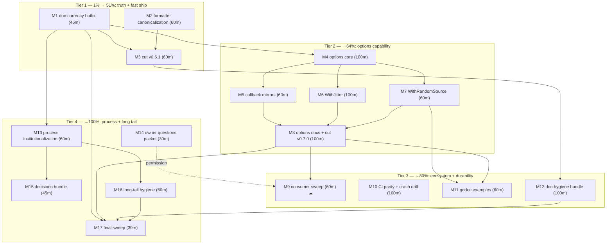

# Pareto Execution Plan — go-retry — Doc Currency, Options Migration & Dual Release

**Written:** 2026-09-16 17:35 CEST
**Baseline:** master `9eb87ee`+`6387a05` (clean tree), go-error-family **v0.10.1**,
`go 1.26` (directive relaxed externally — decision pending, M14), TODO_LIST
T22–T33 open, `[Unreleased]` holds 4 entries, formatter automation exists but
is unidentified (emphasis rewrites in `9eb87ee`).
**Goal:** restore full documentation truth, land the options-pattern migration
(the v1.0 capability unlock), ship it as v0.7.0, propagate to consumers, and
close every open item from the 2026-09-16 status report §f + TODO_LIST T22–T33.
**Mode:** plan only — execution starts on owner approval.

---

## Ground rules (Verschlimmbesserung guards)

1. **Never re-open decided items** — except where this plan explicitly retires
   them: the jitter deferral retires ONLY by landing `WithJitter` (M6/M8); the
   AGENTS gotcha is rewritten then, not before.
2. **Compat contract is sacred:** `Config`'s 8-field public shape never
   changes; struct literals keep compiling; options are a purely additive
   variadic tail. Pinned by tests in M4 before anything else lands.
3. **Single-ownership docs:** a fact lives in exactly one living doc; released
   facts freeze into CHANGELOG sections.
4. **No CQRS/OTel imports. Ever.** (`doc.go` boundary.)
5. **Coverage stays 100% locally; the CI floor only moves via M15's explicit
   decision.**
6. **Gates before every commit:** `gofmt -l .` → `go vet ./...` → `go test
   ./... -race` (count=10 for guard tests) → `golangci-lint run ./...` →
   `golangci-lint config verify` (only after `.golangci.yml` touches) →
   coverage. Formatter check (M2) joins the ritual once identified.
7. **No force push; no `git reset`;** owner approval gates: releases (per-cut
   in M3/M8), cross-repo writes (M9), tools.go (M14 answer).
8. **Function-name citations only** in prose docs; no line numbers, no
   hardcoded dependency patch versions.
9. **Preserve the three deliberate `//nolint:` markers** and terminal-error
   constants.
10. **New guard tests must be proven to fail** on their drift before they count.

---

## Pareto breakdown

| Slice  | Tasks (cumulative)      | Delivers                                                                                                                                                                                                                     |
| ------ | ----------------------- | ---------------------------------------------------------------------------------------------------------------------------------------------------------------------------------------------------------------------------- |
| **1%** | M1                      | **51%** — documentation truth restored after the external v0.10.1 bump: CHANGELOG entry, compat-matrix note, version-cite fix, corpus proof. The repo's product IS honest docs; right now every dependency claim is 1 bump stale. |
| **4%** | M1–M3 (+M2)             | **64%** — tooling truth (the formatter that rewrites our markdown gets identified, documented, and run) + release muscle: v0.6.1 ships the 5 accumulated non-API entries and exercises T30/T31/T33c cheaply.                     |
| **20%** | M1–M12                 | **80%** — the capability tier: options migration (M4–M7) lands `WithJitter`/`WithRandomSource`/callback mirrors without breaking anyone, ships as v0.7.0 (M8), propagates to the consumer (M9), CI parity + first-ever fuzz-failure drill (M10), entry-point examples (M11), mechanical doc guards (M12). |
| **100%** | M1–M17                | Process institutionalization, owner decisions packet, long-tail hygiene, final verification sweep.                                                                                                                           |

---

## Medium plan (17 tasks, 30–100 min each, impact-sorted)

| M   | Task                          | Tier | Effort | Depends      | Outcome (why it matters)                                                                                                                        |
| --- | ----------------------------- | ---- | ------ | ------------ | ------------------------------------------------------------------------------------------------------------------------------------------------ |
| M1  | **Doc-currency hotfix**       | 1    | 45 min | —            | Every published claim true again post-v0.10.1: CHANGELOG entry, matrix note + bump-decider trace, DOMAIN_LANGUAGE cite fix, corpus proof         |
| M2  | **Formatter canonicalization**| 1    | 60 min | —            | The mystery formatter identified, documented, run; markdown drift becomes a gate, not archaeology                                                 |
| M3  | **Cut v0.6.1**                | 1    | 60 min | M1, M2       | 5 non-API entries shipped; T30 (local govulncheck), T31 (notes skeleton), T33c (tidy no-diff) all exercised; deck cleared for v0.7.0              |
| M4  | **Options core**              | 2    | 100 min| M1           | `Option` type + variadic tails on `Do`/`DoWithValue`, compat pinned, precedence tested — the purely additive foundation                           |
| M5  | **Callback mirrors**          | 2    | 60 min | M4           | `WithIsRetryable`/`WithDelayFunc`/`WithOnRetry`/`WithExhausted` + coexistence tests                                                               |
| M6  | **WithJitter**                | 2    | 100 min| M4           | The twice-deferred jitter question LANDS as a designed capability: seam + `None`/`Additive` strategies (full/equal/decorrelated explicitly scoped) |
| M7  | **WithRandomSource**          | 2    | 60 min | M4           | Deterministic RNG seam; `TestBackoff_IncreasesExponentially` becomes sample-based                                                                 |
| M8  | **Options docs + cut v0.7.0** | 2    | 100 min| M5–M7        | FEATURES/README/ROADMAP/AGENTS updated (jitter gotcha retired), CHANGELOG curated, v0.7.0 tagged + verified                                       |
| M9  | **Consumer sweep**            | 3    | 60 min | M8, M14 ☁    | `go-cqrs-lite/middleware/v4` pins current go-retry; kills "Imported by: 0"; strengthens the v1.0 freeze claim (owner-gated)                        |
| M10 | **CI parity + crash drill**   | 3    | 100 min| M2 (gates)   | `workflow_dispatch` on ci.yml; FIRST execution of the fuzz failure path (artifact + minimization budget); cancel check; run watch                 |
| M11 | **Godoc examples**            | 3    | 60 min | M7, M8       | `Backoff`/`ComputeDelay` exampled deterministically (Rejection path + RNG-pinned happy path); docs-site precondition #3 complete                  |
| M12 | **Doc-hygiene bundle**        | 3    | 100 min| M3           | Compare-link guard, link-rot sweep, GitHub render check, pkg.go.dev canonical check, coverage-format note — doc rot becomes mechanical            |
| M13 | **Process institutionalization** | 4 | 60 min | M1           | §f→M mapping table in TODO_LIST, ritual updated (formatter + link guard), gotcha-cap policy, annotation-process notes                             |
| M14 | **Owner questions packet**    | 4    | 30 min | —            | 8 open decisions asked ONCE, in one message; ROADMAP marked "asked"; doc alignment queued on answers                                              |
| M15 | **Decisions bundle**          | 4    | 45 min | M13          | Coverage-floor 95→99 decision (+CI change if raised); supply-chain-triggered fuzz priced and recorded (likely deferred)                           |
| M16 | **Long-tail hygiene**         | 4    | 60 min | M13          | Marker-coverage sweep, Dependabot-rebase observation, §b/§c routing pointers, bench trigger note, ROADMAP idea seeds                              |
| M17 | **Final verification sweep**  | 4    | 30 min | all          | Full ritual end-to-end, plan-vs-done reconciliation with `done at` hashes, next-plan seeds                                                        |

☁ = owner-gated (cannot start without the M14 answer; prepare everything up to the gate).

**Parallelization:** M1 ∥ M2 ∥ M14 start immediately. M4 starts after M1 (docs
stable). M6 ∥ M7 after M4 — both touch `computeDelay`, so sequential rebase
discipline (one lands, the other rebases same-day). M10 is Tier-3 but
doc-independent — run it alongside Tier 2. M12 after M3 (needs the new tag for
link checks). M9/M11 after M8.

---

## Micro plan (≤12 min each — complete breakdown)

### M1 — Doc-currency hotfix (7 micros, 45 min)

| #   | Task                                                                                     | Min |
| --- | ---------------------------------------------------------------------------------------- | --- |
| 1.1 | CHANGELOG `[Unreleased]`: entry for README deadline-budgets guidance (CONTRIBUTING policy) | 8   |
| 1.2 | ROADMAP compat matrix: v0.10.1 note row + "who bumps go-error-family" trace sentence      | 10  |
| 1.3 | DOMAIN_LANGUAGE: replace hardcoded `v0.10.0` with symbol + "see `go.mod`" cite            | 5   |
| 1.4 | AGENTS error-family section: confirm API-surface wording survives v0.10.1 (gates say yes) | 5   |
| 1.5 | TODO_LIST: post-`9eb87ee` formatter-drift eyeball (tables/emphasis render correctly)      | 5   |
| 1.6 | Corpus proof post-bump: `go test -run '^FuzzComputeDelayNeverPanics$' .` green            | 4   |
| 1.7 | Full gates + commit                                                                       | 8   |

### M2 — Formatter canonicalization (7 micros, 60 min)

| #   | Task                                                                                          | Min |
| --- | --------------------------------------------------------------------------------------------- | --- |
| 2.1 | Fingerprint the tool: diff `9eb87ee`'s rewrites (`*x*`→`_x_`, table alignment) against dprint/prettier/markdownlint behaviors; inspect nix profiles | 12  |
| 2.2 | Locate/run the binary (`nix run nixpkgs#dprint -- check` or identified equivalent) over docs   | 10  |
| 2.3 | CONTRIBUTING: canonical invocation + `_emphasis_` convention documented                        | 8   |
| 2.4 | Format all session markdown; commit drift fixes separately                                     | 12  |
| 2.5 | AGENTS commands: add the formatter one-liner                                                   | 5   |
| 2.6 | FEATURES Documentation & DX row: formatter entry                                               | 5   |
| 2.7 | Gates + commit                                                                                 | 8   |

### M3 — Cut v0.6.1 (10 micros, 60 min)

| #    | Task                                                                                        | Min |
| ---- | ------------------------------------------------------------------------------------------- | --- |
| 3.1  | T25 decision recorded: v0.6.1 patch (5 entries, none consumer-visible) in TODO_LIST          | 8   |
| 3.2  | CHANGELOG: promote `[Unreleased]` → `[0.6.1] - 2026-09-16` + compare links                   | 8   |
| 3.3  | ROADMAP: current-release line → v0.6.1                                                       | 5   |
| 3.4  | Full gate + `go mod tidy`/`go mod verify`                                                    | 10  |
| 3.5  | Local `govulncheck ./...` (T30 — first ritual exercise)                                      | 10  |
| 3.6  | SSH-signed annotated tag `v0.6.1`                                                            | 5   |
| 3.7  | GitHub Release composed from the CHANGELOG section                                           | 10  |
| 3.8  | pkg.go.dev render verify — canonical URL (also resolves §f.19's banner question)             | 8   |
| 3.9  | Capture release-notes skeleton → CONTRIBUTING (T31)                                          | 8   |
| 3.10 | `go mod tidy` no-diff confirm at tag (T33c)                                                  | 3   |

### M4 — Options core (10 micros, 100 min)

| #    | Task                                                                                      | Min |
| ---- | ----------------------------------------------------------------------------------------- | --- |
| 4.1  | Add unexported `jitterStrategy`/`randSource` fields to `Config` + doc comments              | 10  |
| 4.2  | `Option func(*Config)` type + `applyOptions` helper (left-to-right, per ROADMAP skeleton)   | 10  |
| 4.3  | `Do` grows variadic tail; options applied AFTER caller Config, BEFORE `Validate`            | 10  |
| 4.4  | `DoWithValue` grows the same tail                                                           | 8   |
| 4.5  | Precedence test: option overrides the field for that call only                              | 10  |
| 4.6  | Compat test: every existing struct-literal call pattern compiles + behaves identically      | 8   |
| 4.7  | Zero-option equivalence table test (new signature vs old semantics)                         | 10  |
| 4.8  | Edge cases: nil option in slice (panic or skip — decide, document), Validate interaction    | 10  |
| 4.9  | Godoc for `Option` + entry points mention the tail                                          | 10  |
| 4.10 | Gates `-race -count=10` + lint + coverage 100% + commit                                     | 12  |

### M5 — Callback mirrors (6 micros, 60 min)

| #   | Task                                                                      | Min |
| --- | ------------------------------------------------------------------------- | --- |
| 5.1 | `WithIsRetryable` + override test                                          | 10  |
| 5.2 | `WithDelayFunc` + test (0-fallback semantics preserved)                    | 10  |
| 5.3 | `WithOnRetry` + test                                                       | 10  |
| 5.4 | `WithExhausted` + test                                                     | 10  |
| 5.5 | Field+option coexistence test (field set, option overrides; option only)   | 8   |
| 5.6 | Gates + commit                                                             | 10  |

### M6 — WithJitter (9 micros, 100 min)

| #   | Task                                                                                         | Min |
| --- | -------------------------------------------------------------------------------------------- | --- |
| 6.1 | `JitterStrategy` type + constants (`JitterAdditive` zero-value = today's default)             | 10  |
| 6.2 | `computeDelay` threads the strategy through; Additive path byte-identical behavior            | 12  |
| 6.3 | `JitterNone`: pure capped exponential (the escape hatch, finally first-class)                 | 10  |
| 6.4 | Deterministic `None` assertions (exact delay sequence)                                        | 12  |
| 6.5 | Scope call: implement full/equal/decorrelated now vs record as follow-ups in ROADMAP          | 12  |
| 6.6 | Fuzz target coverage for the strategy dimension (keep `FuzzComputeDelayNeverPanics` green)    | 10  |
| 6.7 | Matrix property test extended across strategies (never panics, never negative, ≤ MaxDelay)    | 10  |
| 6.8 | Godoc: `Backoff`/`ComputeDelay` document strategy interaction                                 | 8   |
| 6.9 | Gates + commit                                                                                | 12  |

### M7 — WithRandomSource (6 micros, 60 min)

| #   | Task                                                                     | Min |
| --- | ------------------------------------------------------------------------ | --- |
| 7.1 | `randSource` field semantics + `WithRandomSource(rand.Source)` option     | 10  |
| 7.2 | Delay computation uses injected source; nil → `math/rand/v2` global       | 10  |
| 7.3 | Determinism test with a fixed source (exact delay sequence)               | 10  |
| 7.4 | Simplify `TestBackoff_IncreasesExponentially` to sampled assertions       | 10  |
| 7.5 | Race check: parallel tests, no shared source state                        | 8   |
| 7.6 | Gates + commit                                                            | 10  |

### M8 — Options docs + cut v0.7.0 (10 micros, 100 min)

| #    | Task                                                                                   | Min |
| ---- | -------------------------------------------------------------------------------------- | --- |
| 8.1  | FEATURES: options rows → FULLY_FUNCTIONAL (post-tests), jitter/RNG WORTH_CONSIDERING rows resolved | 10  |
| 8.2  | README: "Options" section with a verified example                                       | 10  |
| 8.3  | ROADMAP: graduate the raw idea; jitter-deferral + deterministic-RNG decision records → "landed" | 10  |
| 8.4  | AGENTS: rewrite the jitter-deferral gotcha (landed via `WithJitter`; do-not-re-propose now covers strategy fields) | 8   |
| 8.5  | CHANGELOG `[Unreleased]`: curated entries for the whole options surface                 | 10  |
| 8.6  | Full gate + coverage 100%                                                               | 12  |
| 8.7  | Promote `[Unreleased]` → `[0.7.0] - <date>` (minor: new API) + compare links            | 8   |
| 8.8  | Signed annotated tag `v0.7.0` + GitHub Release + tidy no-diff                           | 10  |
| 8.9  | pkg.go.dev verify (options + `With*` docs render)                                       | 8   |
| 8.10 | TODO_LIST T22/T25 close-out notes (for the next ANNOTATE pass)                          | 8   |

### M9 — Consumer sweep (6 micros, 60 min) ☁ owner-gated

| #   | Task                                                                                   | Min |
| --- | -------------------------------------------------------------------------------------- | --- |
| 9.1 | Enumerate consumers: `go-cqrs-lite` go.mod grep + Sourcegraph sweep                      | 10  |
| 9.2 | Confirm the ROADMAP Open-question answer authorizes cross-repo writes                   | 5   |
| 9.3 | Consumer branch: bump `go-retry` to v0.7.0                                              | 10  |
| 9.4 | Consumer suite `-race` green                                                            | 12  |
| 9.5 | Compat-matrix rule check (surface unchanged → no extra go-retry minor)                  | 8   |
| 9.6 | PR + evidence comment; report back                                                      | 10  |

### M10 — CI parity + crash drill (10 micros, 100 min)

| #    | Task                                                                                | Min |
| ---- | ----------------------------------------------------------------------------------- | --- |
| 10.1 | ci.yml: add `workflow_dispatch` (T26)                                               | 5   |
| 10.2 | actionlint one-liner green + commit                                                 | 8   |
| 10.3 | Watch push CI green (incl. the pending `9eb87ee` run — §f.3)                        | 10  |
| 10.4 | Throwaway branch: inject a panic into the delay path                                | 10  |
| 10.5 | `workflow_dispatch` fuzz on the branch; confirm the job FAILS                       | 10  |
| 10.6 | Verify `fuzz-crash-corpus-<sha>` artifact uploaded with real crashers               | 10  |
| 10.7 | Log-math check: minimization stayed inside the 45-min budget                        | 8   |
| 10.8 | Concurrency cancel check: double-push a PR branch, observe superseded run cancel (T33b) | 10  |
| 10.9 | Dependabot rebase observation if an actions-group PR arrived (T33a)                 | 8   |
| 10.10 | Delete drill branch; record failure-path evidence (AGENTS gotcha update: path is now runner-proven) | 10  |

### M11 — Godoc examples (6 micros, 60 min)

| #   | Task                                                                                      | Min |
| --- | ----------------------------------------------------------------------------------------- | --- |
| 11.1 | Determinism design: `Rejection` path for `attempt < 1` + RNG-pinned happy path (needs M7) | 10  |
| 11.2 | `ExampleBackoff` with `// Output:`                                                        | 12  |
| 11.3 | `ExampleComputeDelay` with `// Output:`                                                   | 12  |
| 11.4 | Output-pins pass locally (`go test`)                                                      | 8   |
| 11.5 | pkg.go.dev render check                                                                   | 8   |
| 11.6 | CHANGELOG entry + gates + commit                                                          | 10  |

### M12 — Doc-hygiene bundle (8 micros, 100 min)

| #   | Task                                                                                         | Min |
| --- | -------------------------------------------------------------------------------------------- | --- |
| 12.1 | Compare-link guard: check script validating every CHANGELOG compare-link tag pair exists in `git tag` (T28) | 20  |
| 12.2 | Wire the guard into Session Ritual + CONTRIBUTING                                            | 8   |
| 12.3 | Link-rot sweep: extract every external link from README/CONTRIBUTING (T29)                   | 20  |
| 12.4 | Fix any dead links found                                                                     | 12  |
| 12.5 | GitHub render check of session-era tables/fences (§f.20)                                     | 10  |
| 12.6 | Coverage canonical-format note in AGENTS ritual (§f.49)                                      | 5   |
| 12.7 | pkg.go.dev canonical-URL check recorded in the release ritual (with M3.8 evidence)           | 8   |
| 12.8 | Gates + commit                                                                               | 10  |

### M13 — Process institutionalization (6 micros, 60 min)

| #   | Task                                                                                       | Min |
| --- | ------------------------------------------------------------------------------------------ | --- |
| 13.1 | TODO_LIST header: §f-report-item → T# → M# mapping table (mechanical ANNOTATE navigation)  | 10  |
| 13.2 | AGENTS Session Ritual: formatter + link-guard join the gate order                          | 8   |
| 13.3 | Gotcha load-bearing review (cap policy: prune before the 21st lands)                       | 10  |
| 13.4 | Ritual notes: final-hash citation before reporting; per-section annotation commits         | 8   |
| 13.5 | Next-annotate prep: this plan's M-numbers cross-referenced in TODO_LIST                    | 8   |
| 13.6 | Gates + commit                                                                             | 10  |

### M14 — Owner questions packet (3 micros, 30 min + wait)

| #   | Task                                                                                          | Min |
| --- | --------------------------------------------------------------------------------------------- | --- |
| 14.1 | Draft the 8-question ask (daemon push, formatter, go-directive intent, consumer permission, retention, 0.x full-release, metadata.yaml, third-tool) | 12  |
| 14.2 | Present to owner; ROADMAP entries marked "asked 2026-09-16"                                    | 8   |
| 14.3 | On answers: align AGENTS/ROADMAP/CONTRIBUTING (execution queued on reply)                      | 10  |

### M15 — Decisions bundle (4 micros, 45 min)

| #   | Task                                                                                          | Min |
| --- | --------------------------------------------------------------------------------------------- | --- |
| 15.1 | Coverage-floor analysis: 100% local vs 95% floor vs proposed 99% (T32) — decide               | 12  |
| 15.2 | If raised: ci.yml coverage job edit + verify                                                  | 10  |
| 15.3 | Supply-chain-triggered fuzz: price trigger + permissions; record decision in ROADMAP (§f.42)  | 12  |
| 15.4 | CHANGELOG entry if CI changed + gates                                                         | 8   |

### M16 — Long-tail hygiene (6 micros, 60 min)

| #   | Task                                                                                    | Min |
| --- | --------------------------------------------------------------------------------------- | --- |
| 16.1 | Marker-coverage sweep: `//nolint:` markers vs enabled linters (standing ritual)        | 10  |
| 16.2 | Dependabot rebase observation post-merge (T33a, if not covered in M10.9)                | 8   |
| 16.3 | Archived report §b/§c inline routing pointers (only where a reader benefits)           | 12  |
| 16.4 | FEATURES bench row: re-check trigger note (toolchain/hardware change)                   | 5   |
| 16.5 | ROADMAP idea seeds: formatter tool, bump-trace auditability                             | 10  |
| 16.6 | Gates + commit                                                                          | 10  |

### M17 — Final verification sweep (3 micros, 30 min)

| #   | Task                                                                                        | Min |
| --- | ------------------------------------------------------------------------------------------- | --- |
| 17.1 | Full ritual end-to-end (gofmt/vet/`-race -count=10`/lint/config-verify/coverage/formatter) | 12  |
| 17.2 | Plan-vs-done reconciliation: annotate this plan's tables with `done at <hash>` verdicts     | 12  |
| 17.3 | Seed the next plan/TODO updates; final commit + push                                        | 8   |

**Totals:** 17 medium tasks (~19.5 h), 117 micro tasks, 100% of open TODO_LIST
T22–T33 + status-report §f items + owner questions mapped (see coverage map).

---

## Execution graph

Run order for one agent: M1 → M2 → M3 → M4 → M5 → M6 → M7 → M8 → M10 → M11 →
M9 (if permitted; else skip clean) → M12 → M13 → M14 (ask early!) → M15 → M16
→ M17. With two agents: A takes M1→M3→M12, B takes M14→M4→M5→M6→M7→M8, then
both converge on M9/M10/M11/M13–M17.

---

## Coverage map — every open item → task

| Source item                                   | Task              |
| --------------------------------------------- | ----------------- |
| TODO_LIST T22 (options migration)             | M4, M5, M6, M7, M8|
| TODO_LIST T23 (consumer sweep)                | M9                |
| TODO_LIST T24 (crash drill)                   | M10               |
| TODO_LIST T25 (next-cut decision)             | M3.1, M8.7        |
| TODO_LIST T26 (workflow_dispatch ci.yml)      | M10.1             |
| TODO_LIST T27 (godoc examples)                | M11               |
| TODO_LIST T28 (compare-link guard)            | M12.1–12.2        |
| TODO_LIST T29 (link-rot sweep)                | M12.3–12.4        |
| TODO_LIST T30 (local govulncheck)             | M3.5              |
| TODO_LIST T31 (release-notes skeleton)        | M3.9              |
| TODO_LIST T32 (coverage-floor decision)       | M15.1–15.2        |
| TODO_LIST T33 (watchlist: 33a/33b/33c)        | M10.9, M10.8, M3.10 |
| Report §f.1 (CHANGELOG deadline-budgets)      | M1.1              |
| Report §f.2 (formatter identify + document)   | M2                |
| Report §f.3 (CI watch 9eb87ee)                | M10.3             |
| Report §f.4 (matrix v0.10.1)                  | M1.2              |
| Report §f.5 (DOMAIN_LANGUAGE version cite)    | M1.3              |
| Report §f.6 (go-directive intent)             | M14.1             |
| Report §f.19 (pkg.go.dev canonical check)     | M3.8, M12.7       |
| Report §f.20 (GitHub render check)            | M12.5             |
| Report §f.21 (next annotate pass)             | M13.5, M17.2      |
| Report §f.22 (gotcha prune)                   | M13.3             |
| Report §f.33 (error-family wording)           | M1.4              |
| Report §f.35 (§b/§c routing pointers)         | M16.3             |
| Report §f.39 (marker coverage)                | M16.1             |
| Report §f.40 (bisectable batches)             | M13.4             |
| Report §f.41 (bump-decider trace)             | M1.2              |
| Report §f.42 (supply-chain fuzz)              | M15.3             |
| Report §f.43 (_emphasis_ doc)                 | M2.3              |
| Report §f.44 (corpus run post-bump)           | M1.6              |
| Report §f.45 (bench re-check trigger)         | M16.4             |
| Report §f.46 (§f→T mapping)                   | M13.1             |
| Report §f.47 (graduate options idea)          | M8.3              |
| Report §f.48 (TODO_LIST drift check)          | M1.5              |
| Report §f.49 (coverage canonical format)      | M12.6             |
| Report §f.50 (final-hash citation)            | M13.4             |
| Owner: daemon push policy                     | M14.1             |
| Owner: formatter canonical                    | M14.1             |
| Owner: go-directive intent                    | M14.1             |
| Owner: consumer-bump permission               | M14.1, gates M9   |
| Owner: archive retention                      | M14.1             |
| Owner: 0.x full-release confirmation          | M14.1             |
| Owner: metadata.yaml keep-or-remove           | M14.1             |
| Owner: third-local-tool / tools.go            | M14.1             |

_Nothing open is unmapped. Items resolved during execution get `done at
<hash>` verdicts in this file's tables (M17.2), keeping the ANNOTATE pass
mechanical._

---

## Exit criteria

1. All 17 M-tasks annotated done (or explicitly deferred with owner-visible
   reasons) in this file.
2. `gofmt`/`go vet`/`go test ./... -race -count=10`/`golangci-lint run`/
   coverage 100%/formatter check — all green at HEAD.
3. Two tagged releases (v0.6.1, v0.7.0) verified end-to-end (proxy, pkg.go.dev,
   clean-room `go get`).
4. `Config` struct-literal compat proven by tests that were seen failing on a
   deliberate break first.
5. TODO_LIST reconciled: completed items deleted (→ CHANGELOG), owner answers
   folded into ROADMAP.
6. Zero unresolved owner questions without a "asked <date>" marker.

_Point-in-time planning snapshot. Items graduate to `TODO_LIST.md` as they
become actionable; this file gets inline `done at <hash>` annotations as work
lands — never rewritten._
