# Pareto Execution Plan: go-retry Post-Gate-Restoration Backlog

- **Created:** 2026-10-08 21:38 CEST
- **Input:** Status report `docs/status/2026-10-08_21-26_buildflow-gate-green-go-directive-root-caused.md` section (f) (40 items), session findings, and open decisions.
- **Method:** Pareto tiers (1 percent delivers 51 percent, 4 percent delivers 64 percent, 20 percent delivers 80 percent, remaining 80 percent of work completes the 100 percent), then a comprehensive plan of 30-100 minute tasks, then a full breakdown into tasks of at most 12 minutes. All 40 input items are covered.
- **Repo state at planning time:** HEAD `1fb7b2f` on `origin/master` (the auto-commit daemon pushes), working tree clean except this plan and the status report. CI + Dependency Graph on `1fb7b2f` in progress; Fuzz green on `b0d15ea`.

## Step 1: Pareto Breakdown

### The 1 percent that delivers 51 percent

**Verify CI is green on the current HEAD (`1fb7b2f`).** Every fix from the gate-restoration session (sentinel retype, flake fixes, dispositions, allowlist re-key) is pushed but only proven locally. CI is the independent verifier; a red run invalidates the "gate green" claim, a green run unlocks the release. One task, and everything else in the plan is de-risked by it.

### The 4 percent that delivers 64 percent

The 1 percent item plus three more:

1. **Regression guard tests for today's dispositions** (`.buildflow.yml` entries, interface-typed sentinels, error-family floor within the 1.26 pin, lychee exclude). The flip-flop war proved that without enforcement, tooling silently reverts deliberate decisions. Guard tests are the repo's own proven pattern for this.
2. **HARVEST the backlog into `TODO_LIST.md` / `ROADMAP.md`.** The status report and this plan are point-in-time snapshots; the living docs are the only current sources. Unharvested, 40 items die in a timestamped file.
3. **Cut the release carrying the sentinel retype.** The retype is API-visible (consumers type-asserting sentinels would notice); until it ships, the work has delivered zero consumer value.

### The 20 percent that delivers 80 percent

The 4 percent items plus: living-docs refresh, a CI stress mode that would have caught both flakes, the go-cqrs-lite consumer sweep, tool availability (lychee so the link scan actually runs), an erraudit CI step, BuildFlow binary rebuild, cross-project lesson capture (lessons.md plus skill references), and the two upstream proposals (structure-linter pin awareness, repair-rewrite summary in the run summary).

### The remaining 80 percent of work (to reach 100 percent)

Everything else: the `tableSeparator` contradiction, `reports/` root directory disposition, dprint TOML plugin, SECURITY and CONTRIBUTING staleness review, pre-commit hook decision, dependabot re-verification, the two ROADMAP decisions (jitter strategies, coverage floor) plus the benchmark decision, `ExampleJitter` godoc examples, nolint marker sweep, fuzz run verification, tools-module x/* bump, a stress integration test locking in the flake-fix patterns, the CI robustness bundle (GOTOOLCHAIN pin decision, release-notes flow check), README refresh post-release, and the archive/metadata annotation pass.

## Step 2: Comprehensive Plan (30-100 min tasks, all 40 input items covered, impact-sorted)

| #   | Tier | Task                                                                                                                                                             | Covers           | Impact   | Effort | Customer value |
| --- | ---- | ---------------------------------------------------------------------------------------------------------------------------------------------------------------- | ---------------- | -------- | ------ | -------------- |
| M1  | P0   | Verify CI + Dependency Graph green on `1fb7b2f`; triage and fix-forward if red                                                                                   | f2               | Critical | 30m    | High           |
| M2  | P0   | Regression guard tests: buildflow dispositions, interface-typed sentinels, dep floor within pin, lychee exclude (each proven failing on drift)                   | f8, f9, f10, f11 | High     | 60m    | High           |
| M3  | P0   | Release cut (go-release flow): CHANGELOG date-out, tag, push, pkg.go.dev verify, go get validation                                                               | f3, f39          | High     | 90m    | High           |
| M4  | P0   | HARVEST plan + status report items into `TODO_LIST.md` / `ROADMAP.md` (docs-health, verify-before-routing)                                                       | f1               | High     | 90m    | Medium         |
| M5  | P1   | Living docs refresh: FEATURES, ROADMAP, TODO_LIST, README claims verified against code                                                                           | f4               | High     | 60m    | Medium         |
| M6  | P1   | CI stress mode for select-race flakes (`-count=3` or scheduled stress job)                                                                                       | f7               | High     | 30m    | Medium         |
| M7  | P1   | go-cqrs-lite consumer sweep via its committed go.work (three suites) + go.work listing check                                                                     | f12, f23         | Medium   | 60m    | Medium         |
| M8  | P1   | Tooling availability: install lychee, run the link scan, audit the other 8 unavailable tools, record the lychee policy position                                  | f5, f19, f6      | Medium   | 30m    | Low            |
| M9  | P1   | erraudit CI step (type-aware gate per skill recipe)                                                                                                              | f33              | Medium   | 45m    | Low            |
| M10 | P1   | BuildFlow binary rebuild once concurrent sessions settle (`nix build .`, reinstall, doctor)                                                                      | f14              | Medium   | 30m    | Low            |
| M11 | P1   | Cross-project capture: select-race lesson to lessons.md, sentinel contract + watcher technique into skill references (by commit)                                 | f15, f16         | Medium   | 45m    | Low            |
| M12 | P1   | Upstream proposals, verify-before-filing first: structure-linter `go-version` pin awareness; BuildFlow repair-rewrite summary line; daemon pre-commit guard idea | f17, f18, f34    | Medium   | 90m    | Low            |
| M13 | P2   | Resolve the `tableSeparator` gopls-vs-golangci-lint contradiction in `docs_test.go`                                                                              | f13              | Low      | 30m    | Low            |
| M14 | P2   | `reports/` root directory: inventory, then document or clean up                                                                                                  | f21              | Low      | 30m    | Low            |
| M15 | P2   | dprint TOML plugin so `lychee.toml` formats; editorconfig TOML section                                                                                           | f24              | Low      | 30m    | Low            |
| M16 | P2   | SECURITY.md + CONTRIBUTING.md staleness review and fixes                                                                                                         | f25              | Low      | 30m    | Low            |
| M17 | P2   | Pre-commit hook: evaluate fit, install or decline with note, test on a scratch commit                                                                            | f26              | Low      | 30m    | Low            |
| M18 | P2   | Dependabot coverage re-verification (gomod root + tools, github-actions)                                                                                         | f27              | Low      | 30m    | Low            |
| M19 | P2   | ROADMAP decisions: jitter strategies implement-or-defer; coverage floor 95 vs 100; jitter benchmark or decline                                                   | f28, f29, f38    | Low      | 60m    | Low            |
| M20 | P2   | `ExampleJitter` godoc examples for the option values                                                                                                             | f30              | Low      | 30m    | Low            |
| M21 | P2   | nolint marker sweep against current linter names                                                                                                                 | f31              | Low      | 30m    | Low            |
| M22 | P2   | Fuzz verification: scheduled run green on GitHub Actions, corpus mirror check, local seeded run                                                                  | f20              | Low      | 30m    | Low            |
| M23 | P2   | tools-module x/* bump toward major.minor-only floors; drop `respect_patch_floor` if achievable                                                                   | f22              | Low      | 60m    | Low            |
| M24 | P2   | Stress integration test for `Do` under real timers and cancellation (locks in the flake-fix patterns)                                                            | f37              | Medium   | 90m    | Medium         |
| M25 | P2   | CI robustness bundle: GOTOOLCHAIN pin decision, release-notes flow drift check                                                                                   | f32, f39         | Low      | 30m    | Low            |
| M26 | P2   | README refresh after the release (badges, version claims)                                                                                                        | f40              | Low      | 30m    | Medium         |
| M27 | P2   | Archive pass: docs-health ANNOTATE on resolvable status reports, metadata drift check, index update                                                              | f35, f36         | Low      | 60m    | Low            |

## Step 3: Detailed Breakdown (every task at most 12 minutes, all todos, impact-sorted)

### P0

| ID   | Task                                                                                                                | Time |
| ---- | ------------------------------------------------------------------------------------------------------------------- | ---- |
| M1.1 | `gh run list` + `gh run view`: wait for CI and Dependency Graph on `1fb7b2f` to conclude                            | 12m  |
| M1.2 | If red: `--log-failed`, triage, fix-forward, re-push                                                                | 12m  |
| M1.3 | Record the CI verdict as an inline annotation on the status report (docs-health ANNOTATE style)                     | 12m  |
| M2.1 | Guard test: parse `.buildflow.yml`, assert `skip_steps` contains `go-mod-update` and the patch-floor option is true | 12m  |
| M2.2 | Guard test: scan `retry.go` for `var Err ... error = errorfamily.NewInfrastructure` on all three sentinels          | 12m  |
| M2.3 | Guard test: `go list -m -f {{.GoVersion}} github.com/larsartmann/go-error-family` resolves to at most `1.26`        | 12m  |
| M2.4 | Guard test: `lychee.toml` contains the larsartmann exclude pattern                                                  | 12m  |
| M2.5 | Mutation drill: break each fixture, observe each guard fail, restore; run with `-count=1`                           | 12m  |
| M3.1 | Pre-release verification battery (gofmt, vet root+tools, race suite, lint, coverage, govulncheck, docs battery)     | 12m  |
| M3.2 | Decide version: sentinel retype is API-visible, so minor (v0.8.0) over patch                                        | 12m  |
| M3.3 | Move CHANGELOG `[Unreleased]` into a dated version section                                                          | 12m  |
| M3.4 | Annotated tag, push tag and master (go-release flow)                                                                | 12m  |
| M3.5 | Verify pkg.go.dev page and GitHub Release notes composed from the CHANGELOG section                                 | 12m  |
| M3.6 | `go get github.com/larsartmann/go-retry@latest` smoke test; ROADMAP bump-trace line if go-error-family moved        | 12m  |
| M4.1 | Load TODO_LIST and ROADMAP; verify-before-routing each candidate premise against code                               | 12m  |
| M4.2 | Route P0 items (guards, release tails) into TODO_LIST                                                               | 12m  |
| M4.3 | Route P1 items (stress mode, consumer sweep, erraudit step, upstream proposals)                                     | 12m  |
| M4.4 | Route P2 items and decisions into ROADMAP                                                                           | 12m  |
| M4.5 | Annotate the status report section (f) as routed; prune resolved TODO_LIST rows                                     | 12m  |
| M4.6 | Run `./scripts/check-docs.sh`                                                                                       | 12m  |

### P1

| ID    | Task                                                                                                 | Time |
| ----- | ---------------------------------------------------------------------------------------------------- | ---- |
| M5.1  | FEATURES.md claims verified against code, drift listed                                               | 12m  |
| M5.2  | ROADMAP.md current-state pass (mark landed items)                                                    | 12m  |
| M5.3  | TODO_LIST.md consistency pass (no stale rows after harvest)                                          | 12m  |
| M5.4  | README claims check (floor pin, dependency-light statement, examples compile)                        | 12m  |
| M5.5  | Fix the drift found; run the docs battery                                                            | 12m  |
| M6.1  | Choose mechanism: raise CI count, or weekly scheduled stress job                                     | 12m  |
| M6.2  | Edit `ci.yml`; if any action re-pins, re-verify inputs and update the allowlist in the same change   | 12m  |
| M6.3  | actionlint + workflows allowlist test + one CI cycle                                                 | 12m  |
| M7.1  | Confirm go-cqrs-lite go.work lists this repo                                                         | 12m  |
| M7.2  | Run commandlifecycle suite against local go-retry                                                    | 12m  |
| M7.3  | Run integration suite                                                                                | 12m  |
| M7.4  | Run example/taskmanager suite                                                                        | 12m  |
| M7.5  | File or fix any finding; record sweep verdict                                                        | 12m  |
| M8.1  | Install lychee (nix profile install nixpkgs#lychee)                                                  | 12m  |
| M8.2  | Run the link-scan step on this repo; fix any real finding                                            | 12m  |
| M8.3  | Audit the other 8 unavailable tools for applicability; record dispositions                           | 12m  |
| M8.4  | Record the lychee authenticate-vs-exclude position and keep the fleet question open                  | 12m  |
| M9.1  | Pick gate mode (`--type-aware` vs `--type legacy_as`) per skill guidance                             | 12m  |
| M9.2  | Wire the step: erraudit via the tools module pin or a pinned action; allowlist if an action is added | 12m  |
| M9.3  | actionlint, allowlist test, docs update                                                              | 12m  |
| M10.1 | Check BuildFlow repo activity (concurrent sessions)                                                  | 12m  |
| M10.2 | `nix build .` in the BuildFlow repo                                                                  | 12m  |
| M10.3 | Reinstall (`nix run .#reinstall`), `buildflow doctor`, confirm freshness warning cleared             | 12m  |
| M11.1 | Write the timer-vs-cancel select-race lesson to crush-config `references/lessons.md` (commit there)  | 12m  |
| M11.2 | Add the sentinel-typing erraudit contract to the go-error-modernization skill reference              | 12m  |
| M11.3 | Add the watcher-plus-step-log correlation technique to the buildflow failure-triage reference        | 12m  |
| M11.4 | Commit, then run the skill fan-out guard from the crush-config repo                                  | 12m  |
| M12.1 | Verify go-structure-linter `go-version` rule behavior at source (verify-before-filing)               | 12m  |
| M12.2 | Draft the pin-awareness issue in github-voice; file it                                               | 12m  |
| M12.3 | Verify BuildFlow's summary code path for repair rewrites                                             | 12m  |
| M12.4 | Draft and file the repair-rewrite summary feature request                                            | 12m  |
| M12.5 | Draft and file the daemon pre-commit guard idea (or decline with rationale)                          | 12m  |

### P2

| ID    | Task                                                                                      | Time |
| ----- | ----------------------------------------------------------------------------------------- | ---- |
| M13.1 | Reproduce the gopls `tableSeparator` finding; identify which analyzer disagrees           | 12m  |
| M13.2 | Remove the dead variable or document the false positive                                   | 12m  |
| M13.3 | Gates: lint, vet, docs battery                                                            | 12m  |
| M14.1 | Inventory `reports/` contents and git history                                             | 12m  |
| M14.2 | Document its purpose or clean it up (git mv to trash-verified removal only with approval) | 12m  |
| M14.3 | Docs battery                                                                              | 12m  |
| M15.1 | Add the dprint TOML plugin to `dprint.json`                                               | 12m  |
| M15.2 | Format TOML files; verify the nix dprint runner picks the plugin up                       | 12m  |
| M15.3 | Editorconfig TOML section; CI dprint check cycle                                          | 12m  |
| M16.1 | SECURITY.md staleness review                                                              | 12m  |
| M16.2 | CONTRIBUTING.md staleness review (mention guard tests and dispositions)                   | 12m  |
| M16.3 | Apply fixes; docs battery                                                                 | 12m  |
| M17.1 | Evaluate the pre-commit hook against this repo's flow                                     | 12m  |
| M17.2 | Install (`buildflow precommit install`) or record the decline rationale                   | 12m  |
| M17.3 | Test the hook on a scratch commit; restore state                                          | 12m  |
| M18.1 | Verify dependabot.yml still covers gomod at root and tools plus github-actions            | 12m  |
| M18.2 | Confirm the weekly schedule is intact; note expected PR classes                           | 12m  |
| M18.3 | Record the verification in the notes file if anything changed                             | 12m  |
| M19.1 | Decide jitter strategies: implement `Full`/`Equal`/`Decorrelated` or formal deferral      | 12m  |
| M19.2 | Decide coverage floor: keep 95 or chase 100 in CI                                         | 12m  |
| M19.3 | Decide jitter benchmark or decline; record all three outcomes in ROADMAP                  | 12m  |
| M20.1 | Write `ExampleJitter` for `JitterAdditive` (zero value, byte-identical default)           | 12m  |
| M20.2 | Write `ExampleJitterNone` (deterministic); godoc output lines verified                    | 12m  |
| M20.3 | Test suite + docs battery                                                                 | 12m  |
| M21.1 | Sweep existing nolint markers against current linter names in `.golangci.yml`             | 12m  |
| M21.2 | Fix any renamed/silenced marker; verify findings reappear where expected                  | 12m  |
| M21.3 | `golangci-lint run` + `golangci-lint config verify`                                       | 12m  |
| M22.1 | Check the latest scheduled fuzz run on GitHub Actions                                     | 12m  |
| M22.2 | Corpus-mirror test + seed constant check                                                  | 12m  |
| M22.3 | Local seeded corpus run (no fuzzing)                                                      | 12m  |
| M23.1 | Inventory current x/* floors in `tools/go.mod`                                            | 12m  |
| M23.2 | `go get -u` + tidy in the tools module                                                    | 12m  |
| M23.3 | Check new floors; if major.minor-only, tighten the directive                              | 12m  |
| M23.4 | Drop `respect_patch_floor` from `.buildflow.yml` if no longer needed                      | 12m  |
| M23.5 | Gates: vet tools, race suite, buildflow single steps                                      | 12m  |
| M24.1 | Design the stress harness (real timers, cancellation interleaving, seeded shuffle)        | 12m  |
| M24.2 | Implement the harness                                                                     | 12m  |
| M24.3 | Wire `-short` skipping and parallel budget                                                | 12m  |
| M24.4 | Mutation drill: prove it catches a reintroduced unbounded assertion                       | 12m  |
| M24.5 | Full gates + `-count=10` loops                                                            | 12m  |
| M25.1 | Decide GOTOOLCHAIN pin: apply `go1.26.x` at workflow level or document deferral           | 12m  |
| M25.2 | Release-notes flow drift check (GitHub-only policy intact, no docs/releases directory)    | 12m  |
| M25.3 | Docs if changed; docs battery                                                             | 12m  |
| M26.1 | README badges and install snippet after the release tag exists                            | 12m  |
| M26.2 | Version claims + example versions consistent                                              | 12m  |
| M26.3 | Docs battery                                                                              | 12m  |
| M27.1 | docs-health ANNOTATE on the 2026-09-17 and 2026-09-18 reports if items resolved           | 12m  |
| M27.2 | Move fully-resolved reports to `docs/status/archived/` with index rows                    | 12m  |
| M27.3 | `.config/metadata.yaml` drift check (external writer; look, do not touch)                 | 12m  |
| M27.4 | Status index consistency (archive vs index test)                                          | 12m  |

## Execution Graph

```mermaid
flowchart TD
    subgraph P0["P0 - the 4 percent that delivers 64 percent"]
        M1["M1 Verify CI on HEAD"]
        M2["M2 Regression guard tests"]
        M4["M4 HARVEST to living docs"]
        M7["M7 Consumer sweep"]
        M3["M3 Release cut"]
    end

    subgraph P1["P1 - completes the 80 percent"]
        M5["M5 Living docs refresh"]
        M6["M6 CI stress mode"]
        M8["M8 Tooling availability"]
        M9["M9 erraudit CI step"]
        M10["M10 BuildFlow binary rebuild"]
        M11["M11 Lessons + skill capture"]
        M12["M12 Upstream proposals"]
    end

    subgraph P2["P2 - the remaining 80 percent of work to 100 percent"]
        M13["M13 tableSeparator"]
        M14["M14 reports/ dir"]
        M15["M15 dprint TOML"]
        M16["M16 SECURITY/CONTRIBUTING"]
        M17["M17 pre-commit decision"]
        M18["M18 dependabot re-verify"]
        M19["M19 ROADMAP decisions"]
        M20["M20 ExampleJitter"]
        M21["M21 nolint sweep"]
        M22["M22 fuzz verification"]
        M23["M23 tools x/* bump"]
        M24["M24 stress integration test"]
        M25["M25 CI robustness bundle"]
        M26["M26 README post-release"]
        M27["M27 archive + metadata"]
    end

    M1 -->|"green"| M2
    M1 -->|"red: fix-forward first"| M1
    M2 --> M3
    M7 --> M3
    M1 --> M4
    M4 --> M5
    M3 --> M26
    M6 --> M24
    M23 --> M10
```

Read it as: M1 gates everything (a red run means fix-forward before any other work). M2 and M7 gate the release. M4 gates the living-docs work. The release gates the README refresh. Everything else runs in tier order and may interleave.

## Verschlimmbesserung guardrails (what NOT to do while executing)

1. Do not remove or weaken the `.buildflow.yml` / `.go-structure-linter.yaml` dispositions; they are deliberate policy with recorded rationale.
2. Do not update the guard test's `1.26` constant without updating every doc that states the floor in the same change (the guard's own failure message says so).
3. Do not re-add jitter strategy constants or a `Config`-level jitter field (closed in v0.7.0; ROADMAP follow-ups only).
4. Do not bulk-edit managed configs (`.golangci.yml`, `dprint.json`) without checking what auto-configure would produce.
5. Do not file upstream issues without the verify-before-filing gate (source-level verification first).
6. Do not rewrite historical reports; annotate non-destructively (docs-health ANNOTATE).
7. Every guard test added must be proven failing on injected drift before it lands.
8. Never judge a gate by a filtered tail; read raw `ok`/`FAIL` summary lines.

## HARVEST note

Per the pareto-planning skill: tasks not already in `TODO_LIST.md` should be added there (M4 does exactly that via docs-health HARVEST with verify-before-routing). This plan is a snapshot; `TODO_LIST.md` / `ROADMAP.md` are the living sources after M4 lands.
